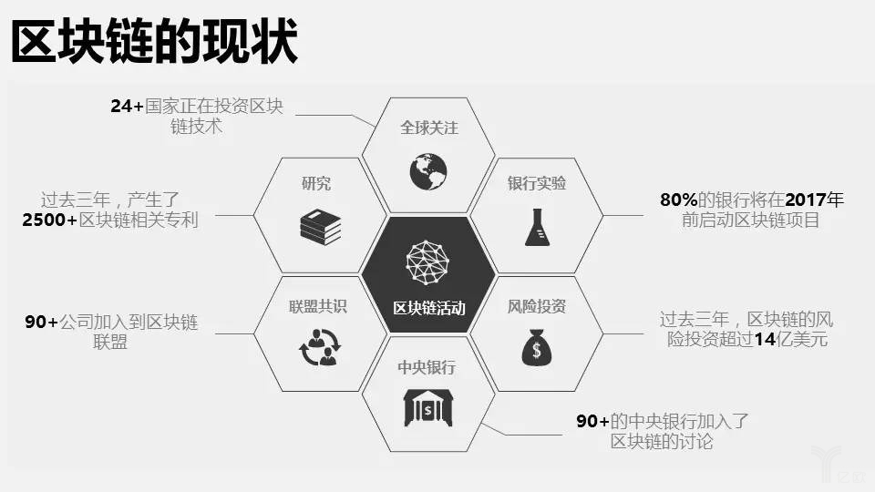
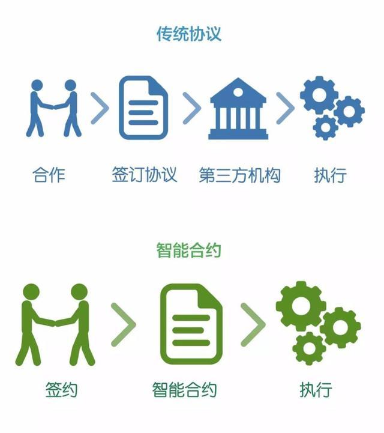

# 区块链和虚拟货币 ✔

区块链是一种用来记账的新技术。新技术刚开始阶段没听过是很正常的，但随着时代发展，就会成为人们熟知的词。 就像手机虽然可以兼具打电话、玩微信、刷抖音等功能，但其主要是作为一个通信工具出现的。区块链也有很多功能，但主要是以一个记账工具的形式出现的。简单来说，区块链是一个用来记账的东西，在它上面记账，记账内容公开透明，所有人都能看见，并且不会被篡改。

**区块链的去中心化的用处？**

以银行为例，很多人去银行存钱取钱，把银行当作一个结算中心，但万一银行有什么小动作，例如拿着钱去做别的事情或是倒闭了，对于消费者而言，看不到银行的操作，因此自己的钱出了状况是很难说清楚的。区块链则相当于把去银行存取钱的人集中在一起作为一个社群，社群里的人共同来维护账本。社群里的每个人都有权记账，没有记账中心，公开透明，也不怕自己的钱被用来做别的事情。那么，谁记帐呢？存钱、取钱的都可以，但谁没事想天天在那里记账？在区块链社群里，谁记账就给谁一万元，当然是抢着记账了。那这一万元从哪里来呢？这就是区块链独有的技术。这个抢到记账权并获得奖励的过程，就是大家所熟知的“挖矿”。

**区块链的不可篡改的作用？**

先举一个小例子，每次在不同的医院看病，每转院一次就要做很多检查，不同的医院里医生并不知道之前的检查过程，因此过程会变得很繁琐，但只要医生把看病过程记录在区块链上，无论又去了哪个医院，查看即可知道病史记录，不会有人更改，还能更快地治病，既节省了病人的时间，也可以提高看病效率。每一个区块都该上了时间戳，所有的区块都和前一个区块相连，一旦更改某一区块的数据，时间戳就对不上了。而且区块链的公开透明性，使得每个人都在监督着账本，想要篡改数据至少要有超过一半的人愿意一起实行。

#### **区块链保护用户隐私**

 区块链上的交易数据，包括交易地址、金额、交易时间等，都公开透明可查询。但是，交易地址对应的所有者身份，是匿名的。借鉴区块链加密技术，可以通过加密算法，实现用户身份和用户数据的分离。用户产生的数据是真实的，而使用这些数据做研究、分析时，因为不能还原对应的用户名、电话、或是注册邮箱，起到了保护用户隐私的作用。

区块链将收集到的用户数据加密存储，意味着访问数据必须提供私钥**。**相比于普通密码，私钥的安全性更高，几乎无法被暴力破解。此外，区块链还将用户信息进行分布式存储，在一 定程度上降低了数据全部被泄漏的风险。中心化的数据库存储，一旦数据库被黑客攻击入侵，数据很容易被全部盗走。

“以比特币为代表的数字虚拟货币，市值终将超越黄金”，因为有这个共识的群体正在不断壮大，所以数字货币的价格也水涨船高。 有共识就有价值，创造价值就是创造共识。 比特币的价值，本质上也是共识。因为虚拟币只存在于互联网，如果想转账、支付、购买虚拟币，只需要网上操作一下就可以了。例如，从比特币钱包的下载数据来看，全世界有200多个国家在用比特币，比美元、人民币等货币都更加国际化。并且虚拟币有抗膨胀性，各国法币的总量没有上限，政府每年都在大量印钱，然而比特币的上限是2100万，任何人不得更改。

#### Stable Coin \(稳定币\)

货币有三种职能——价格尺度，交换媒介和价值储存。

对于比特币等主流虚拟货币而言，唯一一项比较全面行使的职能是价格尺度。价格波动过大制约了这些虚拟货币介入更多的使用场景，使其在履行另外两项职能时稍显逊色。因此，便有了对稳定币（Stable coin）的需求。假如将来有一天数字货币能够被币圈以外的普通人接受，那么最先被认可的币种，一定是一种基于某种锚定机制的稳定币。

稳定币是指价格波动比较小的一种虚拟货币。稳定币既具有法币的稳定性，又具有数字货币的去中心化的特点。在加密货币市场，目前占有率最大的稳定币是与美元挂钩的USDT，即USDT等于1美元。稳定币是我们能够充分使用区块链技术的保障。消费者贷款等应用都要求在区块链上具有较低波动。如果使用波动性大的虚拟币将汇款从一个国家发送到另一个国家，那么很有可能在一个区块确认期间的价格变动将大于Western Union或PayPal收取的费用。

#### Zero-Knowledge Proof \(ZKP - 零知识证明\)

Zero-Knowledge Proof \(ZKP\) 是零币\(Zcoin\)使用的共识算法，指的是证明者能够在不向验证者提供任何有用的信息的情况下，使验证者相信某个论断是正确的。

零知识证明实质上是一种涉及两方或更多方的协议，即两方或更多方完成一项任务所需采取的一系列步骤。证明者向验证者证明并使其相信自己知道或拥有某一消息，但证明过程不能向验证者泄漏任何关于被证明消息的信息。在零知识证明中，证明者和验证者之间必须进行交互，这样的零知识证明被称为“交互零知识证明”。零知识证明，不降低安全性，且工作高效，双方交换信息少，保证了用户隐私。

在区块链中，ZCASH数字货币就是使用零知识证明，在整个交易过程中，完全匿名。

#### Smart Contract \(智能合约\)

智能合约是区块链技术的一个组成部分。它们自动执行交易，将信息记录到分类帐中，无需人工干预。智能合约是一种软件程序，是数字化的，可以在特定条件下控制各方面之间的加密货币转账。智能合约最大的优势是利用程序算法替代人仲裁和执行合同，基本上消除了文书工作，进而简化了整个流程并节省了时间和资金。智能合约一旦编写好就可以被用户信赖，合约条款不能被改变，因此合约是不可更改的。区块链智能合约有三个特性：数据透明，不可篡改，永久运行。

如果能够通过区块链来发行法币，那么也可以通过智能合约技术，将代码嵌入到法币发行的行为中，则这部分法币可以被称为“可编程货币”。比如，与房屋租金协议相关的智能合约只有当业主收到租金才会触发自动执行，并将公寓的安全密钥发送给租户。这个合约可以确保租金的定期支付，并且每个月重启。

假设您通过airbnb租了一周公寓，除了这是一个存在于区块链上的airbnb版本，可用加密货币进行支付。付款后，您会收到一份按智能合约的代码规定的数字收据。智能合约会跟踪您是否收到了“数字密钥”。如果您未在指定日期之前获得此密钥，智能合约会自动退款。当然，当房屋钥匙等物品与互联网数字化绑定时，此类程序的运行效果最佳。这就是物联网和区块链结合后会在未来产生巨大能量的原因，且能实现跨行业的巨大转变。“物联网”是物理设备的网络，如嵌入了软件和传感器的家用电器，可以通过互联网连接和交换数据。

